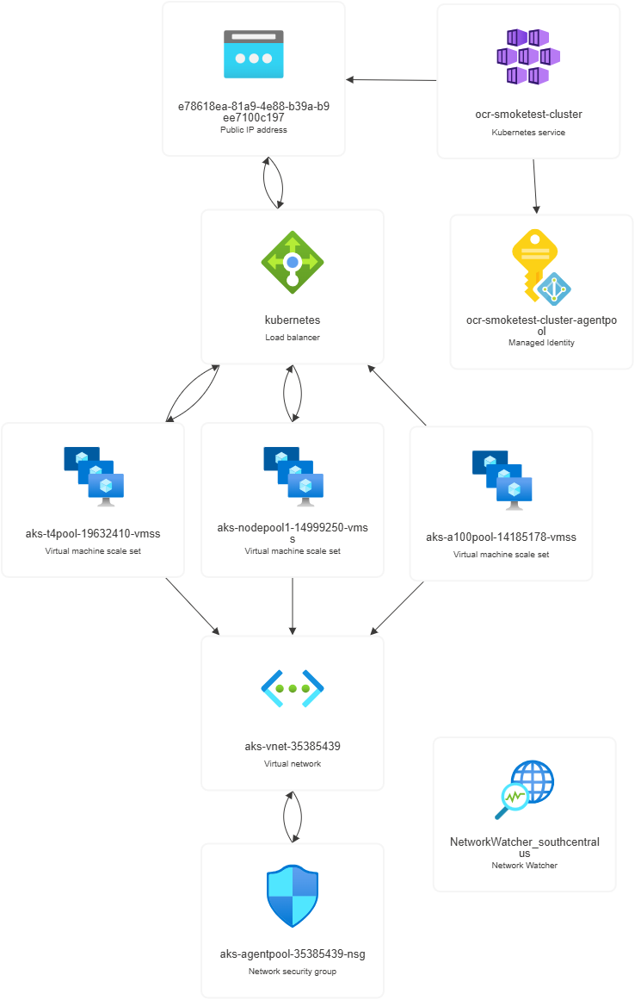

# Hands-on Lab!

Pick a region and a throwaway resource group name, then create the group. Everything below lands inside it, so a single delete cleans up the whole lab.

```bash
LOC=southcentralus
RG=gpu-smoketest-rg

az group create --name $RG --location $LOC
```

`provisioningState: Succeeded` is the only field that matters here. A resource group is just a container — nothing is billed yet.

result:

```bash
{
  "id": "/subscriptions/00000000-1111-2222-3333-444444444444/resourceGroups/gpu-smoketest-rg",
  "location": "southcentralus",
  "managedBy": null,
  "name": "gpu-smoketest-rg",
  "properties": {
    "provisioningState": "Succeeded"
  },
  "tags": null,
  "type": "Microsoft.Resources/resourceGroups"
}
```

Before building a cluster, prove the GPU quota is actually usable by booting one A100 VM. This is the cheapest way to find out that a subscription is capped in a region. `--generate-ssh-keys` reuses `~/.ssh/id_rsa` or creates it.

```bash
az vm create \
  --resource-group $RG \
  --name gpu-smoketest \
  --location $LOC \
  --size Standard_NC24ads_A100_v4 \
  --image Ubuntu2204 \
  --admin-username azureuser \
  --generate-ssh-keys \
  --public-ip-sku Standard
```

The VM booted, so the quota is real. Keep the `publicIpAddress` for SSH; a quota failure would have surfaced here instead.

result:

```bash
Consider upgrading security for your workloads using Azure Trusted Launch VMs. To know more about Trusted Launch, please visit https://aka.ms/TrustedLaunch.
{
  "fqdns": "",
  "id": "/subscriptions/00000000-1111-2222-3333-444444444444/resourceGroups/gpu-smoketest-rg/providers/Microsoft.Compute/virtualMachines/gpu-smoketest",
  "location": "southcentralus",
  "macAddress": "00-11-22-33-44-55",
  "powerState": "VM running",
  "privateIpAddress": "10.0.0.4",
  "publicIpAddress": "203.0.113.10",
  "resourceGroup": "gpu-smoketest-rg"
}
```

Check power state on its own. The JMESPath `--query` pulls just the status line out of the instance view instead of dumping the whole object.

```bash
az vm get-instance-view \
  --resource-group $RG --name gpu-smoketest \
  --query "instanceView.statuses[?starts_with(code,'PowerState')].displayStatus" \
  -o tsv
```

Running — region and quota both check out. Smoke test passed.

result:

```bash
VM running
```

Delete the group immediately: an A100 bills by the second whether or not you use it. `--no-wait` returns straight away and lets Azure tear down in the background.

```bash
az group delete --name $RG --yes --no-wait
```

Now the real lab. A separate resource group and cluster name, so the smoke test's teardown can't touch it.

```bash
RG=ocr-smoketest-aks-rg
CLUSTER=ocr-smoketest-cluster
```

Create the group that will hold the cluster.

```bash
az group create --name $RG --location $LOC
```

Same container, new name — this one holds the cluster.

result:

```bash
{
  "id": "/subscriptions/00000000-1111-2222-3333-444444444444/resourceGroups/ocr-smoketest-aks-rg",
  "location": "southcentralus",
  "managedBy": null,
  "name": "ocr-smoketest-aks-rg",
  "properties": {
    "provisioningState": "Succeeded"
  },
  "tags": null,
  "type": "Microsoft.Resources/resourceGroups"
}
```

Create the cluster with a single cheap CPU node. This is the *system* pool: it runs CoreDNS, metrics-server and the other add-ons. Keeping it off GPU hardware means the expensive pools can scale to zero.

```bash
az aks create \
  --resource-group $RG --name $CLUSTER \
  --location $LOC \
  --node-count 1 --node-vm-size Standard_D4s_v5 \
  --generate-ssh-keys
```

A wall of JSON; four fields are worth reading. `provisioningState: Succeeded` and `powerState.code: Running` mean the cluster is up, `nodeResourceGroup` (`MC_…`) names the second, auto-managed group where the VMs, load balancer and vnet actually live, and `identityProfile.kubeletidentity` is the managed identity the nodes use to pull images.

result:

```bash
{
  "aadProfile": null,
  "addonProfiles": null,
  "agentPoolProfiles": [
    {
      "artifactStreamingProfile": null,
      "availabilityZones": null,
      "capacityReservationGroupId": null,
      "count": 1,
      "creationData": null,
      "currentOrchestratorVersion": "1.35.6",
      "eTag": "739ecdc4-ca62-403f-bb1d-1b7fcf982b1f",
      "enableAutoScaling": false,
      "enableEncryptionAtHost": false,
      "enableFips": false,
      "enableNodePublicIp": false,
      "enableUltraSsd": false,
      "gatewayProfile": null,
      "gpuInstanceProfile": null,
      "gpuProfile": null,
      "hostGroupId": null,
      "kubeletConfig": null,
      "kubeletDiskType": "OS",
      "linuxOsConfig": null,
      "localDnsProfile": null,
      "maxCount": null,
      "maxPods": 250,
      "messageOfTheDay": null,
      "minCount": null,
      "mode": "System",
      "name": "nodepool1",
      "networkProfile": null,
      "nodeImageVersion": "AKSUbuntu-2404gen2containerd-202607.20.0",
      "nodeLabels": null,
      "nodePublicIpPrefixId": null,
      "nodeTaints": null,
      "orchestratorVersion": "1.35",
      "osDiskSizeGb": 128,
      "osDiskType": "Managed",
      "osSku": "Ubuntu",
      "osType": "Linux",
      "podIpAllocationMode": null,
      "podSubnetId": null,
      "powerState": {
        "code": "Running"
      },
      "provisioningState": "Succeeded",
      "proximityPlacementGroupId": null,
      "scaleDownMode": "Delete",
      "scaleSetEvictionPolicy": null,
      "scaleSetPriority": null,
      "securityProfile": {
        "enableSecureBoot": false,
        "enableVtpm": false,
        "sshAccess": "LocalUser"
      },
      "spotMaxPrice": null,
      "status": null,
      "tags": null,
      "type": "VirtualMachineScaleSets",
      "upgradeSettings": {
        "drainTimeoutInMinutes": null,
        "maxSurge": "10%",
        "maxUnavailable": "0",
        "nodeSoakDurationInMinutes": null,
        "undrainableNodeBehavior": null
      },
      "virtualMachineNodesStatus": null,
      "virtualMachinesProfile": null,
      "vmSize": "Standard_D4s_v5",
      "vnetSubnetId": null,
      "windowsProfile": null,
      "workloadRuntime": null
    }
  ],
  "aiToolchainOperatorProfile": null,
  "apiServerAccessProfile": null,
  "autoScalerProfile": null,
  "autoUpgradeProfile": {
    "nodeOsUpgradeChannel": "NodeImage",
    "upgradeChannel": null
  },
  "azureMonitorProfile": null,
  "azurePortalFqdn": "ocr-smoket-ocr-smoketest-ak-000000-abcd1234.portal.hcp.southcentralus.azmk8s.io",
  "bootstrapProfile": {
    "artifactSource": "Direct",
    "containerRegistryId": null
  },
  "currentKubernetesVersion": "1.35.6",
  "disableLocalAccounts": false,
  "diskEncryptionSetId": null,
  "dnsPrefix": "ocr-smoket-ocr-smoketest-ak-000000",
  "eTag": "032465c7-c94b-4675-b0d8-5b83d770115b",
  "enableRbac": true,
  "extendedLocation": null,
  "fqdn": "ocr-smoket-ocr-smoketest-ak-000000-abcd1234.hcp.southcentralus.azmk8s.io",
  "fqdnSubdomain": null,
  "hostedSystemProfile": {
    "enabled": false,
    "nodeSubnetId": null,
    "systemNodeSubnetId": null
  },
  "httpProxyConfig": null,
  "id": "/subscriptions/00000000-1111-2222-3333-444444444444/resourcegroups/ocr-smoketest-aks-rg/providers/Microsoft.ContainerService/managedClusters/ocr-smoketest-cluster",
  "identity": {
    "delegatedResources": null,
    "principalId": "22222222-3333-4444-5555-666666666666",
    "tenantId": "11111111-2222-3333-4444-555555555555",
    "type": "SystemAssigned",
    "userAssignedIdentities": null
  },
  "identityProfile": {
    "kubeletidentity": {
      "clientId": "33333333-4444-5555-6666-777777777777",
      "objectId": "44444444-5555-6666-7777-888888888888",
      "resourceId": "/subscriptions/00000000-1111-2222-3333-444444444444/resourcegroups/MC_ocr-smoketest-aks-rg_ocr-smoketest-cluster_southcentralus/providers/Microsoft.ManagedIdentity/userAssignedIdentities/ocr-smoketest-cluster-agentpool"
    }
  },
  "ingressProfile": null,
  "kind": "Base",
  "kubernetesVersion": "1.35",
  "linuxProfile": {
    "adminUsername": "azureuser",
    "ssh": {
      "publicKeys": [
        {
          "keyData": "ssh-rsa AAAAB3NzaC1yc2EAAAADAQABAAABAQ...<redacted>"
        }
      ]
    }
  },
  "location": "southcentralus",
  "maxAgentPools": 100,
  "metricsProfile": {
    "costAnalysis": {
      "enabled": false
    }
  },
  "name": "ocr-smoketest-cluster",
  "networkProfile": {
    "advancedNetworking": null,
    "dnsServiceIp": "10.0.0.10",
    "ipFamilies": [
      "IPv4"
    ],
    "loadBalancerProfile": {
      "allocatedOutboundPorts": null,
      "backendPoolType": "nodeIPConfiguration",
      "effectiveOutboundIPs": [
        {
          "id": "/subscriptions/00000000-1111-2222-3333-444444444444/resourceGroups/MC_ocr-smoketest-aks-rg_ocr-smoketest-cluster_southcentralus/providers/Microsoft.Network/publicIPAddresses/e78618ea-81a9-4e88-b39a-b9ee7100c197",
          "resourceGroup": "MC_ocr-smoketest-aks-rg_ocr-smoketest-cluster_southcentralus"
        }
      ],
      "enableMultipleStandardLoadBalancers": null,
      "idleTimeoutInMinutes": null,
      "managedOutboundIPs": {
        "count": 1,
        "countIpv6": null
      },
      "outboundIPs": null,
      "outboundIpPrefixes": null
    },
    "loadBalancerSku": "standard",
    "natGatewayProfile": null,
    "networkDataplane": "azure",
    "networkMode": null,
    "networkPlugin": "azure",
    "networkPluginMode": "overlay",
    "networkPolicy": "none",
    "outboundType": "loadBalancer",
    "podCidr": "10.244.0.0/16",
    "podCidrs": [
      "10.244.0.0/16"
    ],
    "serviceCidr": "10.0.0.0/16",
    "serviceCidrs": [
      "10.0.0.0/16"
    ],
    "staticEgressGatewayProfile": null
  },
  "nodeProvisioningProfile": {
    "defaultNodePools": null,
    "mode": "Manual"
  },
  "nodeResourceGroup": "MC_ocr-smoketest-aks-rg_ocr-smoketest-cluster_southcentralus",
  "nodeResourceGroupProfile": null,
  "oidcIssuerProfile": {
    "enabled": true,
    "issuerUrl": "https://southcentralus.oic.prod-aks.azure.com/11111111-2222-3333-4444-555555555555/55555555-6666-7777-8888-999999999999/"
  },
  "podIdentityProfile": null,
  "powerState": {
    "code": "Running"
  },
  "privateFqdn": null,
  "privateLinkResources": null,
  "provisioningState": "Succeeded",
  "publicNetworkAccess": null,
  "resourceGroup": "ocr-smoketest-aks-rg",
  "resourceUid": "6a7470867be58d0001519003",
  "schedulerProfile": null,
  "securityProfile": {
    "azureKeyVaultKms": null,
    "customCaTrustCertificates": null,
    "defender": null,
    "imageCleaner": null,
    "workloadIdentity": null
  },
  "serviceMeshProfile": null,
  "servicePrincipalProfile": {
    "clientId": "msi",
    "secret": null
  },
  "sku": {
    "name": "Base",
    "tier": "Free"
  },
  "status": null,
  "storageProfile": {
    "blobCsiDriver": null,
    "diskCsiDriver": {
      "enabled": true
    },
    "fileCsiDriver": {
      "enabled": true
    },
    "snapshotController": {
      "enabled": true
    }
  },
  "supportPlan": "KubernetesOfficial",
  "systemData": null,
  "tags": null,
  "type": "Microsoft.ContainerService/ManagedClusters",
  "upgradeSettings": null,
  "windowsProfile": null,
  "workloadAutoScalerProfile": {
    "keda": null,
    "verticalPodAutoscaler": null
  }
}
```

Add the T4 pool for layout and detection models. `--min-count 0` means it costs nothing while idle; the `nvidia.com/gpu` taint keeps ordinary pods off the GPU nodes, and the `workload=layout` label is what your deployments will target with a node selector.

```bash
az aks nodepool add \
  --resource-group $RG --cluster-name $CLUSTER \
  --name t4pool \
  --node-vm-size Standard_NC16as_T4_v3 \
  --enable-cluster-autoscaler --min-count 0 --max-count 4 \
  --labels workload=layout \
  --node-taints nvidia.com/gpu=present:NoSchedule
```

Pool is `Running` with the label and taint applied. Note `gpuProfile.driver: Install` — AKS installs the NVIDIA driver on these nodes for you, so you don't need the GPU operator just to get drivers.

result:

```bash
{
  "artifactStreamingProfile": null,
  "availabilityZones": null,
  "capacityReservationGroupId": null,
  "count": 3,
  "creationData": null,
  "currentOrchestratorVersion": "1.35.6",
  "eTag": "e5779c63-9452-4841-ae9c-47d776c44c04",
  "enableAutoScaling": true,
  "enableEncryptionAtHost": false,
  "enableFips": false,
  "enableNodePublicIp": false,
  "enableUltraSsd": false,
  "gatewayProfile": null,
  "gpuInstanceProfile": null,
  "gpuProfile": {
    "driver": "Install"
  },
  "hostGroupId": null,
  "id": "/subscriptions/00000000-1111-2222-3333-444444444444/resourcegroups/ocr-smoketest-aks-rg/providers/Microsoft.ContainerService/managedClusters/ocr-smoketest-cluster/agentPools/t4pool",
  "kubeletConfig": null,
  "kubeletDiskType": "OS",
  "linuxOsConfig": null,
  "localDnsProfile": null,
  "maxCount": 4,
  "maxPods": 250,
  "messageOfTheDay": null,
  "minCount": 0,
  "mode": "User",
  "name": "t4pool",
  "networkProfile": null,
  "nodeImageVersion": "AKSUbuntu-2404gen2containerd-202607.20.0",
  "nodeLabels": {
    "workload": "layout"
  },
  "nodePublicIpPrefixId": null,
  "nodeTaints": [
    "nvidia.com/gpu=present:NoSchedule"
  ],
  "orchestratorVersion": "1.35",
  "osDiskSizeGb": 144,
  "osDiskType": "Ephemeral",
  "osSku": "Ubuntu",
  "osType": "Linux",
  "podIpAllocationMode": null,
  "podSubnetId": null,
  "powerState": {
    "code": "Running"
  },
  "provisioningState": "Succeeded",
  "proximityPlacementGroupId": null,
  "resourceGroup": "ocr-smoketest-aks-rg",
  "scaleDownMode": "Delete",
  "scaleSetEvictionPolicy": null,
  "scaleSetPriority": null,
  "securityProfile": {
    "enableSecureBoot": false,
    "enableVtpm": false,
    "sshAccess": "LocalUser"
  },
  "spotMaxPrice": null,
  "status": null,
  "systemData": null,
  "tags": null,
  "type": "Microsoft.ContainerService/managedClusters/agentPools",
  "typePropertiesType": "VirtualMachineScaleSets",
  "upgradeSettings": {
    "drainTimeoutInMinutes": null,
    "maxSurge": "10%",
    "maxUnavailable": "0",
    "nodeSoakDurationInMinutes": null,
    "undrainableNodeBehavior": "Schedule"
  },
  "virtualMachineNodesStatus": null,
  "virtualMachinesProfile": null,
  "vmSize": "Standard_NC16as_T4_v3",
  "vnetSubnetId": null,
  "windowsProfile": null,
  "workloadRuntime": null
}
```

Same pattern for the A100 pool, sized for inference. Two pools instead of one lets you send cheap layout work to T4s and keep the A100s for the model that actually needs them.

```bash
az aks nodepool add \
  --resource-group $RG --cluster-name $CLUSTER \
  --name a100pool \
  --node-vm-size Standard_NC24ads_A100_v4 \
  --enable-cluster-autoscaler --min-count 0 --max-count 4 \
  --labels workload=inference \
  --node-taints nvidia.com/gpu=present:NoSchedule
```

Identical shape to the T4 pool — autoscaler 0→4, taint set, driver installed — just a larger VM and `workload=inference`.

result:

```bash
{
  "artifactStreamingProfile": null,
  "availabilityZones": null,
  "capacityReservationGroupId": null,
  "count": 3,
  "creationData": null,
  "currentOrchestratorVersion": "1.35.6",
  "eTag": "e41d21c4-1d36-457c-9ee9-120af792bde2",
  "enableAutoScaling": true,
  "enableEncryptionAtHost": false,
  "enableFips": false,
  "enableNodePublicIp": false,
  "enableUltraSsd": false,
  "gatewayProfile": null,
  "gpuInstanceProfile": null,
  "gpuProfile": {
    "driver": "Install"
  },
  "hostGroupId": null,
  "id": "/subscriptions/00000000-1111-2222-3333-444444444444/resourcegroups/ocr-smoketest-aks-rg/providers/Microsoft.ContainerService/managedClusters/ocr-smoketest-cluster/agentPools/a100pool",
  "kubeletConfig": null,
  "kubeletDiskType": "OS",
  "linuxOsConfig": null,
  "localDnsProfile": null,
  "maxCount": 4,
  "maxPods": 250,
  "messageOfTheDay": null,
  "minCount": 0,
  "mode": "User",
  "name": "a100pool",
  "networkProfile": null,
  "nodeImageVersion": "AKSUbuntu-2404gen2containerd-202607.20.0",
  "nodeLabels": {
    "workload": "inference"
  },
  "nodePublicIpPrefixId": null,
  "nodeTaints": [
    "nvidia.com/gpu=present:NoSchedule"
  ],
  "orchestratorVersion": "1.35",
  "osDiskSizeGb": 256,
  "osDiskType": "Ephemeral",
  "osSku": "Ubuntu",
  "osType": "Linux",
  "podIpAllocationMode": null,
  "podSubnetId": null,
  "powerState": {
    "code": "Running"
  },
  "provisioningState": "Succeeded",
  "proximityPlacementGroupId": null,
  "resourceGroup": "ocr-smoketest-aks-rg",
  "scaleDownMode": "Delete",
  "scaleSetEvictionPolicy": null,
  "scaleSetPriority": null,
  "securityProfile": {
    "enableSecureBoot": false,
    "enableVtpm": false,
    "sshAccess": "LocalUser"
  },
  "spotMaxPrice": null,
  "status": null,
  "systemData": null,
  "tags": null,
  "type": "Microsoft.ContainerService/managedClusters/agentPools",
  "typePropertiesType": "VirtualMachineScaleSets",
  "upgradeSettings": {
    "drainTimeoutInMinutes": null,
    "maxSurge": "10%",
    "maxUnavailable": "0",
    "nodeSoakDurationInMinutes": null,
    "undrainableNodeBehavior": "Schedule"
  },
  "virtualMachineNodesStatus": null,
  "virtualMachinesProfile": null,
  "vmSize": "Standard_NC24ads_A100_v4",
  "vnetSubnetId": null,
  "windowsProfile": null,
  "workloadRuntime": null
}
```

Pull the cluster's kubeconfig so `kubectl` talks to it.

```bash
az aks get-credentials --resource-group $RG --name $CLUSTER
```

Merged into `~/.kube/config` and set as the active context — every `kubectl` from here on hits this cluster.

result:

```bash
Merged "ocr-smoketest-cluster" as current context in /home/<user>/.kube/config
```

First real check: did every node register with the control plane?

```bash
kubectl get nodes
```

All seven `Ready`, one per pool prefix. The GPU pools show three nodes each rather than zero because `nodepool add` defaults to `--node-count 3`; the autoscaler only drains them down to `--min-count 0` after they sit idle.

result:

```bash
NAME                                STATUS   ROLES    AGE     VERSION
aks-a100pool-14185178-vmss000000    Ready    <none>   8m8s    v1.35.6
aks-a100pool-14185178-vmss000001    Ready    <none>   8m23s   v1.35.6
aks-a100pool-14185178-vmss000002    Ready    <none>   8m18s   v1.35.6
aks-nodepool1-14999250-vmss000000   Ready    <none>   21m     v1.35.6
aks-t4pool-19632410-vmss000000      Ready    <none>   13m     v1.35.6
aks-t4pool-19632410-vmss000001      Ready    <none>   13m     v1.35.6
aks-t4pool-19632410-vmss000002      Ready    <none>   13m     v1.35.6
```

Resource visualizer:




Drivers alone aren't enough: the scheduler doesn't know the GPUs exist until something advertises them. The NVIDIA device plugin runs as a DaemonSet on every GPU node and registers `nvidia.com/gpu` as an allocatable resource, which is what `resources.limits` in your pod spec asks for.

```bash
kubectl apply -f https://raw.githubusercontent.com/NVIDIA/k8s-device-plugin/v0.16.2/deployments/static/nvidia-device-plugin.yml
```

Created. It tolerates the `nvidia.com/gpu` taint, so it schedules onto the T4 and A100 nodes and starts reporting their capacity.

result:

```bash
daemonset.apps/nvidia-device-plugin-daemonset created
```

Tear it all down. Six GPU VMs bill continuously, and deleting the group takes the cluster, the `MC_…` group and everything in both with it.

```bash
az group delete --name $RG --yes --no-wait
```


