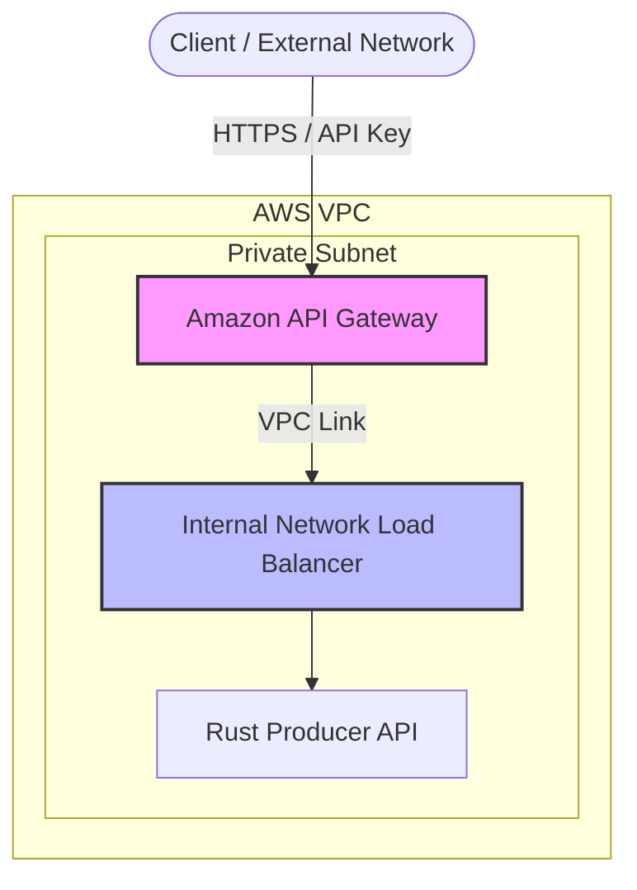

## 🛠️ Deployment Lifecycle (Elastic Kubernetes Service - EKS)

> **Before you start:** this guide assumes you already have an AWS account,
> approved GPU quota, and an IAM user/CLI session. If you haven't done that
> yet, go through [`aws_onboarding.md`](aws_onboarding.md) and
> [`aws_gpu_prereqs.md`](aws_gpu_prereqs.md) first. Note that the
> capacity-proof cluster built in Section 7 of `aws_gpu_prereqs.md` is
> disposable and unrelated to the cluster built below — delete it if you
> haven't already, this guide creates its own from scratch.
>
> **One real architecture difference from AKS/GKE:** AWS has no single-GPU
> A100 instance, so the heavy pool here runs on **H100** (`p5.4xlarge`)
> instead of A100 — see the callout in `aws_gpu_prereqs.md` Section 1 if you'd
> rather use `p4d.24xlarge` (A100, 8 GPUs/node, fixed) for strict parity.

### 0. Prerequisites & Environment Variables

```bash
# --- Core Identifiers ---
export LOCATION="eu-west-1"
export AWS_ACCOUNT_ID=$(aws sts get-caller-identity --query Account --output text)
export EKS_NAME="eks-ocr-cluster"
export ECR_REGISTRY="${AWS_ACCOUNT_ID}.dkr.ecr.${LOCATION}.amazonaws.com"
```

### 🔑 Authenticate AWS CLI Session

Before proceeding, ensure your AWS CLI session is authenticated as the IAM
user/role you set up in `aws_onboarding.md`, and pointed at the right region.

```bash
aws sts get-caller-identity
aws configure set region $LOCATION
```

> Expected: `aws sts get-caller-identity` shows the IAM user/role you created,
> not the root account.

---

### 1. Infrastructure Setup: EKS & Storage

```bash
# 1. Create the EKS cluster (control plane + a base CPU nodegroup)
eksctl create cluster \
  --name $EKS_NAME \
  --region $LOCATION \
  --nodegroup-name base \
  --node-type m5.xlarge \
  --nodes 1

# 2. Download EKS credentials
aws eks update-kubeconfig --name $EKS_NAME --region $LOCATION

# 3. GPU Node Pool (H100 80GB) - vLLM Inference Server
#    Swap --node-type for p4d.24xlarge for the A100-parity route (see the
#    callout above — a single p4d.24xlarge node already provides 8 GPUs).
eksctl create nodegroup \
  --cluster $EKS_NAME --region $LOCATION \
  --name gpunph100 \
  --node-type p5.4xlarge \
  --nodes 1 --nodes-min 0 --nodes-max 4 \
  --node-taints "nvidia.com/gpu=present:NoSchedule" \
  --asg-access --managed

# 4. GPU Node Pool (T4 16GB) - Layout Consumer Worker
eksctl create nodegroup \
  --cluster $EKS_NAME --region $LOCATION \
  --name gpunpt4 \
  --node-type g4dn.xlarge \
  --nodes 1 --nodes-min 0 --nodes-max 4 \
  --node-taints "nvidia.com/gpu=present:NoSchedule" \
  --asg-access --managed

# 5. High-Memory CPU Node Pool (Redis)
eksctl create nodegroup \
  --cluster $EKS_NAME --region $LOCATION \
  --name redisnp \
  --node-type r5.xlarge \
  --nodes 1 --nodes-min 1 --nodes-max 3 \
  --node-labels "app=redis-store" \
  --node-taints "sku=redis:NoSchedule" \
  --asg-access --managed

# 6. CPU-Optimized Node Pool (API Gateway)
eksctl create nodegroup \
  --cluster $EKS_NAME --region $LOCATION \
  --name apinp \
  --node-type t3.small \
  --nodes 1 --nodes-min 1 --nodes-max 5 \
  --node-labels "app=api-gateway" \
  --node-taints "sku=api:NoSchedule" \
  --asg-access --managed
```

> `eksctl` auto-labels every node in a managed node group with
> `eks.amazonaws.com/nodegroup=<name>` — that's what the GPU deployments
> below use as their `nodeSelector`, so no `--node-labels` is needed on the
> two GPU pools. The Redis/API pools use a custom `app=` label instead, same
> as the AKS/GKE guides.

#### 🛡️ GPU Lifecycle on EKS: Preinstalled Drivers + Manual Device Plugin

Third option compared to AKS/GKE: `eksctl` detects that `p5.4xlarge` and
`g4dn.xlarge` are GPU instance types and automatically selects the
**EKS-optimized accelerated AMI**, which ships with the NVIDIA drivers and
container toolkit **preinstalled** — there's no Helm GPU Operator to install
(unlike AKS) and no per-node-pool driver flag (unlike GKE's
`gpu-driver-version=default`). You still need to apply the device plugin
DaemonSet yourself, though — EKS doesn't do that part automatically:

```bash
kubectl apply -f https://raw.githubusercontent.com/NVIDIA/k8s-device-plugin/v0.16.2/deployments/static/nvidia-device-plugin.yml
```

**Install the Cluster Autoscaler.** Unlike AKS's `--enable-cluster-autoscaler`
or GKE's `--enable-autoscaling`, an eksctl node group's `--nodes-min`/`--nodes-max`
only sets the underlying Auto Scaling Group's bounds — nothing actually scales
the nodes until the Kubernetes Cluster Autoscaler is running. `--asg-access`
above already granted the node IAM role permission to call the Auto Scaling
API; `eksctl`-managed node groups are also auto-tagged for autoscaler
discovery, so this is just installing the workload itself:

```bash
helm repo add autoscaler https://kubernetes.github.io/autoscaler
helm repo update
helm install cluster-autoscaler autoscaler/cluster-autoscaler \
  --namespace kube-system \
  --set autoDiscovery.clusterName=$EKS_NAME \
  --set awsRegion=$LOCATION
```

#### 🔍 Verify GPU Schedulability

```bash
# 1. Check GPU Capacity & Allocatable (Summary Table)
kubectl get nodes "-o=custom-columns=NAME:.metadata.name,GPU_CAPACITY:.status.capacity.nvidia\.com/gpu,GPU_ALLOCATABLE:.status.allocatable.nvidia\.com/gpu"

# 2. Inspect node taints and allocatable resources
kubectl describe nodes | grep -A 5 "Allocatable" | grep "nvidia.com/gpu"

# 3. Verify node group labels
kubectl get nodes -L eks.amazonaws.com/nodegroup
```

> **Pro Tip:** If `GPU_ALLOCATABLE` shows `0` or `<none>`, the device plugin
> DaemonSet hasn't scheduled on that node yet — check `kubectl get pods -A -o
> wide | grep device-plugin` and confirm it tolerates the
> `nvidia.com/gpu=present:NoSchedule` taint (the static manifest above already
> does).

---

### 📦 2. Model Ingestion: Datacenter-to-Datacenter

Models are treated as **heavy binary data**. Ingest them directly inside the
cluster using a Kubernetes **Job**, backed by an **Amazon EFS** PVC (the
`ReadWriteMany` volume both the ingestion job and the inference pods share).

#### 2.1 Provision Shared Storage (EFS)

Unlike Azure Blob (`--enable-blob-driver`) or GCP Filestore
(`--addons=GcpFilestoreCsiDriver`), EKS has no one-flag managed RWX storage —
the EFS CSI driver, the filesystem, and its mount targets are all separate
resources you provision yourself.

```bash
# 1. Enable IAM OIDC provider for the cluster (needed for the CSI driver's IRSA role)
eksctl utils associate-iam-oidc-provider --cluster $EKS_NAME --region $LOCATION --approve

# 2. Create an IAM role for the EFS CSI driver and install it as an EKS addon
eksctl create iamserviceaccount \
  --cluster $EKS_NAME --region $LOCATION \
  --namespace kube-system --name efs-csi-controller-sa \
  --role-name AmazonEKS_EFS_CSI_DriverRole \
  --attach-policy-arn arn:aws:iam::aws:policy/service-role/AmazonEFSCSIDriverPolicy \
  --role-only --approve

aws eks create-addon \
  --cluster-name $EKS_NAME --region $LOCATION \
  --addon-name aws-efs-csi-driver \
  --service-account-role-arn arn:aws:iam::${AWS_ACCOUNT_ID}:role/AmazonEKS_EFS_CSI_DriverRole

# 3. Create the EFS filesystem
FS_ID=$(aws efs create-file-system --region $LOCATION \
  --performance-mode generalPurpose --encrypted \
  --tags Key=Name,Value=ocr-model-weights \
  --query "FileSystemId" --output text)
aws efs wait file-system-available --file-system-id $FS_ID --region $LOCATION
echo "EFS filesystem: $FS_ID"

# 4. Allow NFS (2049) from inside the cluster's VPC
VPC_ID=$(aws eks describe-cluster --name $EKS_NAME --region $LOCATION \
  --query "cluster.resourcesVpcConfig.vpcId" --output text)
CIDR=$(aws ec2 describe-vpcs --vpc-ids $VPC_ID --region $LOCATION \
  --query "Vpcs[0].CidrBlock" --output text)
EFS_SG=$(aws ec2 create-security-group --group-name ocr-efs-sg \
  --description "Allow NFS from the EKS cluster VPC" --vpc-id $VPC_ID --region $LOCATION \
  --query "GroupId" --output text)
aws ec2 authorize-security-group-ingress \
  --group-id $EFS_SG --protocol tcp --port 2049 --cidr $CIDR --region $LOCATION

# 5. Create a mount target in every cluster subnet
for SUBNET in $(aws eks describe-cluster --name $EKS_NAME --region $LOCATION \
  --query "cluster.resourcesVpcConfig.subnetIds" --output text); do
  aws efs create-mount-target --file-system-id $FS_ID \
    --subnet-id $SUBNET --security-groups $EFS_SG --region $LOCATION
done
```

Fill in the filesystem ID and apply the StorageClass, then the PVC:

```bash
# Replace <EFS_FILE_SYSTEM_ID> with $FS_ID from above
sed -i "s/<EFS_FILE_SYSTEM_ID>/$FS_ID/" k8s/eks/infra/provisioning/storageclass.yaml
kubectl apply -f k8s/eks/infra/provisioning/storageclass.yaml

kubectl apply -f k8s/eks/infra/provisioning/pvc.yaml
kubectl get pvc model-weights-pvc
```

**Expected Output:**
```text
NAME                STATUS   VOLUME                                     CAPACITY   ACCESS MODES   STORAGECLASS   AGE
model-weights-pvc   Bound    pvc-1a2b3c4d-5e6f-7890-abcd-ef0123456789   300Gi      RWX            efs-sc         12s
```

#### 2.2 Launch the Ingestion Job

```bash
kubectl apply -f k8s/eks/infra/provisioning/ingest-job.yaml
kubectl get job model-weight-ingest
```

#### 2.3 Observe Progress

```bash
kubectl logs -f job/model-weight-ingest
```

*(Once you see `✅ Ingestion complete`, clean up the job with `kubectl delete job model-weight-ingest`)*

#### 2.4 Debugging & Manual Inspection (Optional)

```bash
kubectl run weights-debug \
  --rm -it \
  --image=ubuntu:22.04 \
  --overrides='
{
  "spec": {
    "containers": [{
      "name": "debug",
      "image": "ubuntu:22.04",
      "command": ["bash"],
      "stdin": true,
      "tty": true,
      "volumeMounts": [{
        "name": "weights",
        "mountPath": "/mnt/models"
      }]
    }],
    "volumes": [{
      "name": "weights",
      "persistentVolumeClaim": {
        "claimName": "model-weights-pvc"
      }
    }]
  }
}'
```

---

### 📦 3. Build & Push Container Images

Amazon ECR needs one repository per image, created once, then pushed to like
any other Docker registry.

```bash
# 1. Create the ECR repositories (idempotent-ish: ignore the error if they already exist)
aws ecr create-repository --repository-name ocr-vlm-qwen --region $LOCATION
aws ecr create-repository --repository-name ocr-api-rust --region $LOCATION
aws ecr create-repository --repository-name ocr-worker-rt --region $LOCATION

# 2. Authenticate Docker against ECR
aws ecr get-login-password --region $LOCATION \
  | docker login --username AWS --password-stdin $ECR_REGISTRY

# 3. Build and push each image
docker build -t ${ECR_REGISTRY}/ocr-vlm-qwen:latest ./server
docker push ${ECR_REGISTRY}/ocr-vlm-qwen:latest

docker build -t ${ECR_REGISTRY}/ocr-api-rust:latest ./client_rt_producer
docker push ${ECR_REGISTRY}/ocr-api-rust:latest

docker build -t ${ECR_REGISTRY}/ocr-worker-rt:latest ./client_rt_consumer
docker push ${ECR_REGISTRY}/ocr-worker-rt:latest
```

Update the `<AWS_ACCOUNT_ID>.dkr.ecr.<REGION>.amazonaws.com/...` image
references in `k8s/eks/apps/deployment-api.yml` and
`k8s/eks/apps/deployment-vlm.yml` to your actual `$ECR_REGISTRY` before
deploying (`sed -i "s#<AWS_ACCOUNT_ID>.dkr.ecr.<REGION>.amazonaws.com#${ECR_REGISTRY}#" k8s/eks/apps/deployment-*.yml`).

---

### 4. Deploy the Full Stack on EKS

```bash
# 1. Install KEDA (Kubernetes Event-driven Autoscaling)
helm repo add kedacore https://kedacore.github.io/charts
helm upgrade --install keda kedacore/keda -n keda --create-namespace

# 2. Install Prometheus Stack (required for vLLM & Redis metrics)
helm repo add prometheus-community https://prometheus-community.github.io/helm-charts
helm repo update

kubectl create namespace monitoring
helm install prometheus prometheus-community/kube-prometheus-stack \
  --namespace monitoring \
  --set prometheus.prometheusSpec.serviceMonitorSelectorNilUsesHelmValues=false \
  --set grafana.enabled=true

# 3. Deploy the AWS Load Balancer Controller (needed before applying networking/service.yml — see Section 6)
eksctl utils associate-iam-oidc-provider --cluster $EKS_NAME --region $LOCATION --approve
curl -sO https://raw.githubusercontent.com/kubernetes-sigs/aws-load-balancer-controller/main/docs/install/iam_policy.json
aws iam create-policy \
  --policy-name AWSLoadBalancerControllerIAMPolicy \
  --policy-document file://iam_policy.json
eksctl create iamserviceaccount \
  --cluster $EKS_NAME --region $LOCATION \
  --namespace kube-system --name aws-load-balancer-controller \
  --attach-policy-arn arn:aws:iam::${AWS_ACCOUNT_ID}:policy/AWSLoadBalancerControllerIAMPolicy \
  --approve

helm repo add eks https://aws.github.io/eks-charts
helm repo update
helm install aws-load-balancer-controller eks/aws-load-balancer-controller \
  -n kube-system \
  --set clusterName=$EKS_NAME \
  --set serviceAccount.create=false \
  --set serviceAccount.name=aws-load-balancer-controller

# 4. Deploy the EKS microservices stack
kubectl apply -k k8s/eks/
```

---

### 5. End-to-End Testing & Validation

#### Inspect Logs (Debug Nodepools)
```bash
# 1. Producer API (apinp) - Rust Gateway
kubectl logs -l app=ocr-api --tail=100 -f

# 2. Consumer Worker (gpunpt4) - Layout Detection (T4)
kubectl logs -l app=ocr-worker-rt --tail=100 -f

# 3. vLLM Server (gpunph100) - Qwen 3.5 4B Inference (H100)
kubectl logs -l app=ocr-vlm --tail=100 -f
```

#### Verify Metrics & Scaling
```bash
# Check T4 GPU Utilization
kubectl exec -it -n monitoring prometheus-prometheus-0 -- \
  promtool query instant http://localhost:9090 "avg(DCGM_FI_DEV_GPU_UTIL)"

# Check H100 vLLM Waiting Requests
kubectl exec -it -n monitoring prometheus-prometheus-0 -- \
  promtool query instant http://localhost:9090 "sum(vllm:num_requests_waiting)"
```

---

### 6. Enterprise Exposure: Internal NLB + API Gateway

Exposing raw Kubernetes services directly to the public internet creates
security risks and uncontrolled autoscaling costs, same concern as the
Azure/GCP guides. On AWS the equivalent zero-trust perimeter is an
**internal Network Load Balancer** (provisioned by the AWS Load Balancer
Controller installed in Section 4) fronted by **Amazon API Gateway** over a
**VPC Link**.



#### 1. Internal NLB (already configured)

`k8s/eks/networking/service.yml` carries the annotations that tell the AWS
Load Balancer Controller to provision an **internal**-scheme NLB targeting
pod IPs directly, rather than a public one:

```yaml
metadata:
  annotations:
    service.beta.kubernetes.io/aws-load-balancer-type: "external"
    service.beta.kubernetes.io/aws-load-balancer-nlb-target-type: "ip"
    service.beta.kubernetes.io/aws-load-balancer-scheme: "internal"
```

#### 2. Retrieve the internal NLB hostname

```bash
NLB_HOSTNAME=$(kubectl get svc ocr-api-service -o jsonpath='{.status.loadBalancer.ingress[0].hostname}')
echo "Private API Service endpoint: $NLB_HOSTNAME"
```

#### 3. Front it with API Gateway (VPC Link + API keys)

Create an API Gateway **HTTP API** with a **VPC Link** pointing at the
internal NLB above, map `/ocr/process` to it, and require an API key /
usage plan — this gives you the same governance role the Azure guide's APIM
setup and the GCP guide's Cloud API Gateway play: rate-limiting and key-based
auth at the edge, so a traffic burst throttles at the gateway instead of
triggering runaway KEDA scale-out on the GPU pools.

```bash
aws apigatewayv2 create-vpc-link \
  --name ocr-vpc-link \
  --subnet-ids $(aws eks describe-cluster --name $EKS_NAME --region $LOCATION --query "cluster.resourcesVpcConfig.subnetIds" --output text) \
  --security-group-ids $EFS_SG \
  --region $LOCATION
```

Wire the resulting VPC Link ID into an HTTP API integration targeting
`$NLB_HOSTNAME:80`, then attach a **Usage Plan** with an **API Key** the same
way you would for any other API Gateway-fronted service — see the
[API Gateway private integration docs](https://docs.aws.amazon.com/apigateway/latest/developerguide/http-api-private-integration.html)
for the full resource/route/integration wiring, which is otherwise identical
to any other HTTP API on API Gateway.

---

### 7. Monitoring & Dashboards (Grafana)

1. **Port-forward the Grafana service**:
   ```bash
   kubectl port-forward -n monitoring svc/prometheus-grafana 3000:80
   ```
2. **Retrieve the admin password**:
   ```bash
   kubectl get secret -n monitoring prometheus-grafana -o jsonpath="{.data.admin-password}" | base64 --decode ; echo
   ```
3. **Access the UI**:
   - Open your browser to: `http://localhost:3000`
   - **Username**: `admin`
   - **Password**: (the string retrieved above)

#### Best practice: Scale to zero

GPU nodes are the most expensive part of the stack. With the Cluster
Autoscaler installed in Section 1, scale a pool to zero by dropping its ASG's
minimum size:

```bash
eksctl scale nodegroup \
  --cluster $EKS_NAME --region $LOCATION \
  --name gpunph100 \
  --nodes 0 --nodes-min 0 --nodes-max 4
```

---

## 🔍 Monitoring & Resources
*   [PaddleOCR-VL 1.5 Pipeline Docs](https://www.paddleocr.ai/main/en/version3.x/pipeline_usage/PaddleOCR-VL.html)
*   [vLLM Inference Engine](https://docs.vllm.ai/)
*   [KEDA Azure Queue Scaler](https://keda.sh/docs/scalers/azure-queue/)
*   [HuggingFace: PaddleOCR-VL 1.5](https://huggingface.co/PaddlePaddle/PaddleOCR-VL-1.5)
*   [AWS Load Balancer Controller](https://kubernetes-sigs.github.io/aws-load-balancer-controller/)
*   [Amazon EFS CSI Driver](https://github.com/kubernetes-sigs/aws-efs-csi-driver)
