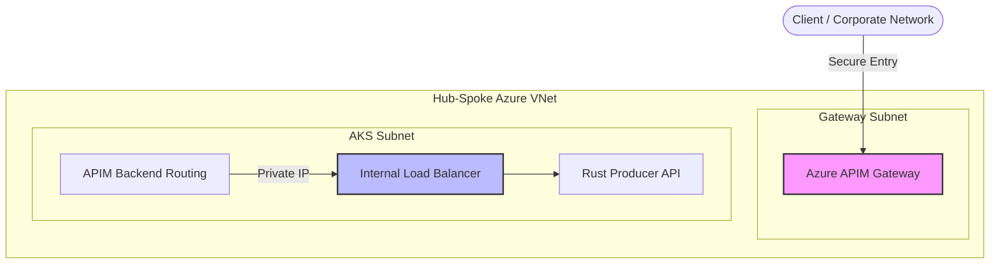

## 🛠️ Deployment Lifecycle

### 0. Prerequisites & Environment Variables

```bash
# --- Core Identifiers ---
export LOCATION="francecentral"
export RESOURCE_GROUP="week3-dpl-rg"
export SUBSCRIPTION_ID="344d2357-2d0a-4eef-bc7b-fff75ee7481e"
export AKS_NAME="akstnmweek3"
export ACR_NAME="acrtnmweek3"
```

### 🧰 Local CLI Tooling Prerequisites

Ensure `azure-cli`, `kubectl`, and `helm` are installed on your local machine so you can run deployment commands directly from your IDE terminal:

```bash
# macOS (via Homebrew)
brew install azure-cli kubernetes-cli helm

# Alternatively via Azure CLI
az aks install-cli
```

### 🔑 Authenticate Azure CLI Session

Before proceeding, ensure your Azure CLI session is authenticated and set to the correct subscription. This step is required for all subsequent resource creation commands.

```bash
az login
az account set --subscription "$SUBSCRIPTION_ID"
az account show --output table

# Register required Azure Resource Providers
az provider register --namespace Microsoft.ContainerRegistry
az provider register --namespace Microsoft.ContainerService
az provider register --namespace Microsoft.Storage
```

> Expected: Your intended subscription shows as `IsDefault = True` (or at least matches `$SUBSCRIPTION_ID`).

### 1. Infrastructure Setup: AKS & Storage

```bash
# 1. Create Resource Group
az group create --name $RESOURCE_GROUP --location $LOCATION

# 2. Create the container registry
az acr create -g $RESOURCE_GROUP -n $ACR_NAME --sku Premium --location $LOCATION

# 3. Download ACR credentials (requires Docker daemon running locally; optional if using `az acr build`)
az acr login --name $ACR_NAME

# 4. Create AKS Cluster
az aks create \
  --resource-group $RESOURCE_GROUP \
  --location $LOCATION \
  --name $AKS_NAME \
  --attach-acr $ACR_NAME \
  --node-count 1 \
  --enable-managed-identity \
  --enable-blob-driver \
  --generate-ssh-keys

# 5. Download AKS credentials
az aks get-credentials \
  --resource-group $RESOURCE_GROUP \
  --name $AKS_NAME

# 6. GPU Node Pool (A100 80GB)
az aks nodepool add \
  --resource-group $RESOURCE_GROUP \
  --cluster-name $AKS_NAME \
  --name gpunpa100 \
  --node-vm-size Standard_NC24ads_A100_v4 \
  --node-count 1 \
  --enable-cluster-autoscaler \
  --min-count 0 \
  --max-count 4 \
  --node-taints sku=gpunpa100:NoSchedule \
  --tags EnableManagedGPUExperience=true
```

> **Note:** Executing `az aks get-credentials` merges the Kubernetes cluster context directly into your local `~/.kube/config`. Once run, all `kubectl` and `helm` commands can be executed natively in your local IDE terminal against your remote AKS cluster.

#### 🛡️ Managed GPU Lifecycle on AKS

By specifying `--tags EnableManagedGPUExperience=true` without `--gpu-driver none`, AKS uses **Native Managed GPU Drivers**. AKS automatically installs the official NVIDIA GRID / CUDA drivers, configures `containerd` with GPU OCI runtime hooks, and runs the managed device plugin out of the box during VM provisioning.

#### 🔍 Verify GPU Schedulability
To verify that AKS has provisioned the GPU node and `nvidia.com/gpu` capacity is allocatable, run:

```bash
# Check if GPU capacity (1x A100) is reported across cluster nodes
kubectl get nodes "-o=custom-columns=NAME:.metadata.name,GPU_CAPACITY:.status.capacity.nvidia\.com/gpu,GPU_ALLOCATABLE:.status.allocatable.nvidia\.com/gpu"
```

### 2. Storage Setup: Datacenter Model Weight Ingestion

To serve model inference without incurring prohibitive download times upon pod initialization, we ingest the weights directly from Hugging Face into an Azure Storage Account (Blob / NFS) shared volume.

```bash
# 1. Create Storage PVC
kubectl apply -f k8s/infra/pvc.yaml

# 2. Deploy Datacenter Weight Ingestion Job
kubectl apply -f k8s/infra/ingest-job.yaml
```

#### 2.3 Observe Progress

Follow the download logs from Hugging Face:

```bash
kubectl logs -f job/model-weight-ingest
```

*(Once complete, clean up with `kubectl delete job model-weight-ingest`)*

#### 2.4 Inspect PVC Contents

Because Azure Blob Storage (`azureblob-fuse-premium`) is an object store, generic POSIX directory listing (`ls /mnt/models`) does not index virtual directories. To explicitly verify all downloaded model files and sizes on your PVC volume, run this inspection pod:

```bash
kubectl run pvc-inspector --rm -i --tty --restart=Never --image=python:3.11-slim --overrides='
{
  "spec": {
    "containers": [{
      "name": "inspector",
      "image": "python:3.11-slim",
      "command": ["python3", "-c", "import os, urllib.request, json, ssl\nmodel_id = \"rednote-hilab/dots.mocr\"\nctx = ssl.create_default_context()\nctx.check_hostname = False\nctx.verify_mode = ssl.CERT_NONE\nreq = urllib.request.Request(f\"https://huggingface.co/api/models/{model_id}\")\nwith urllib.request.urlopen(req, context=ctx) as r:\n    files = [s[\"rfilename\"] for s in json.loads(r.read().decode())[\"siblings\"]]\nprint(f\"Checking {len(files)} files on Blob PVC:\")\nfor f in files:\n    fp = f\"/mnt/models/{model_id}/{f}\"\n    if os.path.exists(fp):\n        sz = os.path.getsize(fp) / (1024*1024)\n        print(f\"  ✅ {f}: {sz:.2f} MB\")\n    else:\n        print(f\"  ❌ {f}: Missing\")\n"],
      "volumeMounts": [{
        "name": "weights",
        "mountPath": "/mnt/models"
      }]
    }],
    "volumes": [{
      "name": "weights",
      "persistentVolumeClaim": {
        "claimName": "model-weights-pvc"
      }
    }]
  }
}'
```

### 3. Build & Push

```bash
az acr login --name $ACR_NAME

# Build the vLLM Server container image (dots.mocr VLM Engine)
az acr build --registry $ACR_NAME --image ocr-vlm-dotsmocr:latest ./server
```

### 4. Deploy the Full Stack

```bash
# 1. Install KEDA
helm repo add kedacore https://kedacore.github.io/charts
helm upgrade --install keda kedacore/keda -n keda --create-namespace

# 2. Install Prometheus Stack (Required for Real-time Scaling)
helm repo add prometheus-community https://prometheus-community.github.io/helm-charts
helm repo update

kubectl create namespace monitoring
helm install prometheus prometheus-community/kube-prometheus-stack \
  --namespace monitoring \
  --set prometheus.prometheusSpec.serviceMonitorSelectorNilUsesHelmValues=false \
  --set grafana.enabled=true

# 3. Deploy vLLM Workload Manifests
kubectl apply -k k8s/
```

### 5. End-to-End Testing & Validation

#### Inspect Logs
To ensure the vLLM server is running correctly, tail the logs for the deployment pod:

```bash
# vLLM Server (gpunpa100) - dots.mocr VLM Inference (A100)
kubectl logs -l app=ocr-vlm --tail=100 -f
```

#### Verify Metrics & Scaling
Check if the metrics are flowing to Prometheus (it may take 2-3 minutes for the first scrape):
```bash
# Check A100 GPU Utilization
kubectl exec -it -n monitoring prometheus-prometheus-0 -- \
  promtool query instant http://localhost:9090 "avg(DCGM_FI_DEV_GPU_UTIL)"

# Check A100 vLLM Waiting Requests
kubectl exec -it -n monitoring prometheus-prometheus-0 -- \
  promtool query instant http://localhost:9090 "sum(vllm:num_requests_waiting)"
```

### 6. Enterprise Exposure: Azure API Management (APIM)

For enterprise-grade deployments, exposing the service via a public IP is not recommended. Instead, we use **Azure API Management (APIM)** in **Internal VNet mode** to provide a secure, governed, and rate-limited entry point.

#### 🛡️ Architecture & Security: Why APIM + VNet Isolation?

By default, exposing Kubernetes services to the public internet using Public IP LoadBalancers introduces security vulnerabilities (DDoS, brute-force requests, unauthorized model consumption) and financial risk (runaway node scaling via KEDA). To build a zero-trust network perimeter around the OCR pipeline, we employ a multi-layered security design:



##### Core Isolation Components:

1. **Private Load Balancing**: The annotation `service.beta.kubernetes.io/azure-load-balancer-internal: "true"` instructs Azure to provision the AKS LoadBalancer in the private cluster subnet rather than assigning a public-facing IP.
2. **Private API Gateways**:
   - **Internal VNet Mode (Recommended for Internal-only APIs)**: APIM is deployed in a dedicated subnet inside the AKS virtual network. It has no public IP and is strictly accessible via **VNet Peering**, **Azure VPN Gateway (P2S/S2S)**, or **ExpressRoute**. This completely prevents any internet exposure.
   - **External VNet Mode (Secure Public Access)**: If the API must be consumed by external clients directly over the internet, APIM is provisioned in External VNet mode. It gets a public IP but serves as a strict gateway where all traffic is validated, filtered, and throttled before passing into the private AKS subnet.
3. **Defense-in-Depth with Azure Application Gateway & WAF**:
   For maximum security, you can chain **Azure Application Gateway** (with Web Application Firewall - WAF) in front of the internal APIM instance. The Application Gateway handles SSL termination and WAF rules (mitigating OWASP Top 10 vulnerabilities), while APIM handles rate-limiting, authentication, and backend routing.


#### 1. Configure Internal Load Balancer
Ensure the AKS service is configured as an **Internal Load Balancer** so it only has a private IP within the VNet. 

**Network Discovery:**
Before provisioning APIM, use these commands to find the exact networking details managed by AKS:
```bash
# 1. Find the Node Resource Group (where AKS networking lives)
NODE_RG=$(az aks show -g $RESOURCE_GROUP -n $AKS_NAME --query nodeResourceGroup -o tsv)

# 2. Find the VNet Name
VNET_NAME=$(az network vnet list -g $NODE_RG --query "[0].name" -o tsv)

# 3. List Subnets (Choose the one used by your AKS node pools)
az network vnet subnet list -g $NODE_RG --vnet-name $VNET_NAME --query "[].name" -o table
```

Update your `k8s/networking/service.yml` with the following annotation:

```yaml
metadata:
  annotations:
    service.beta.kubernetes.io/azure-load-balancer-internal: "true"
```

#### 2. Provision APIM in Internal Mode
Deploy an APIM instance (Developer or Premium tier) into the same VNet as your AKS cluster. This allows APIM to route traffic to the internal `ocr-api-service` IP without crossing the public internet.

```bash
# 1. Create the APIM Instance (Internal Mode)
# Replace <vnet-id> and <subnet-name> with your specific network details
az apim create \
  --name "apim-ocr-service" \
  --resource-group $RESOURCE_GROUP \
  --location $LOCATION \
  --publisher-email "admin@yourcompany.com" \
  --publisher-name "OCR Team" \
  --sku-name Developer \
  --virtual-network Internal \
  --vnet-id "/subscriptions/$SUBSCRIPTION_ID/resourceGroups/$RESOURCE_GROUP/providers/Microsoft.Network/virtualNetworks/<vnet-name>" \
  --subnet-name "<subnet-name>"

# 2. Wait for deployment (APIM can take 30-45 mins to provision)
```

#### 3. Define Backend & Security Policies
These commands configure APIM to act as the secure gateway for your internal AKS service.

**A. Define the Backend (The Internal AKS Service)**
```bash
# Get the internal IP of your service
INTERNAL_IP=$(kubectl get svc ocr-api-service -o jsonpath='{.status.loadBalancer.ingress[0].ip}')

az apim backend create \
  --resource-group $RESOURCE_GROUP \
  --service-name "apim-ocr-service" \
  --backend-id "ocr-api-backend" \
  --url "http://$INTERNAL_IP" \
  --protocol http
```

**B. Create the API & Operations**
```bash
az apim api create \
  --resource-group $RESOURCE_GROUP \
  --service-name "apim-ocr-service" \
  --api-id "ocr-api" \
  --path "ocr" \
  --display-name "High-Performance OCR API"

az apim api operation create \
  --resource-group $RESOURCE_GROUP \
  --service-name "apim-ocr-service" \
  --api-id "ocr-api" \
  --url-template "/process" \
  --method "POST" \
  --display-name "Process Document"
```

**C. Apply Governance Policies**
**Governance Note:** While vLLM and Workers are `ClusterIP` scope, throttling at the APIM layer provides **indirect protection** for GPU resources. By limiting the ingestion rate of the Producer API, we prevent abusive bursts from triggering unnecessary KEDA scale-out events on the expensive A100/T4 node pools.

```bash
# Apply the JWT and Rate-Limit policy
az apim api operation policy set \
  --resource-group $RESOURCE_GROUP \
  --service-name "apim-ocr-service" \
  --api-id "ocr-api" \
  --operation-id "post-process" \
  --policy-value "k8s/networking/apim-policy.xml"
```

**D. Provision API Keys (Subscriptions)**
Group the API into a **Product** to enable **API Key (Subscription)** authentication. This is ideal for external partners or simple CLI usage.

```bash
# 1. Create a Product
az apim product create \
  --resource-group $RESOURCE_GROUP \
  --service-name "apim-ocr-service" \
  --product-id "ocr-partner-tier" \
  --display-name "OCR Partner Tier" \
  --subscription-required true \
  --state published

# 2. Add API to Product
az apim product api add \
  --resource-group $RESOURCE_GROUP \
  --service-name "apim-ocr-service" \
  --product-id "ocr-partner-tier" \
  --api-id "ocr-api"

# 3. Create a Subscription (Generates the API Key)
az apim subscription create \
  --resource-group $RESOURCE_GROUP \
  --service-name "apim-ocr-service" \
  --subscription-id "partner-abc-key" \
  --display-name "Partner ABC Subscription" \
  --product-id "ocr-partner-tier" \
  --state active

# 4. Retrieve the API Key
az apim subscription show \
  --resource-group $RESOURCE_GROUP \
  --service-name "apim-ocr-service" \
  --subscription-id "partner-abc-key" \
  --query primaryKey -o tsv
```

#### 4. Access Control & Extending Authorization

This deployment supports a **Hybrid Security Model**:

*   **Zero-Trust JWT**: Validates internal identities via Microsoft Entra ID. Use the `Authorization: Bearer <token>` header.
*   **API Key (Subscription)**: Provides access for external partners or simplified CLI use. Use the `Ocp-Apim-Subscription-Key: <key>` header.

**Governance Features:**
*   **Indirect GPU Protection**: Throttling occurs at the gateway. This prevents high-volume bursts from triggering expensive KEDA scale-out events on the A100/T4 nodes.
*   **Tiered Access**: By creating different **APIM Products**, you can assign different rate limits to different users (e.g., "Gold" partners get 500 calls/min, "Free" users get 10).

**Example Request with API Key:**
```bash
curl -X POST "https://apim-ocr-service.azure-api.net/ocr/process" \
     -H "Ocp-Apim-Subscription-Key: YOUR_API_KEY" \
     -F "file=@invoice.pdf"
```

### 6. Monitoring & Dashboards (Grafana)

To see the real-time scaling events and GPU utilization, you can access the Grafana dashboard:

1. **Port-forward the Grafana service**:
   ```bash
   kubectl port-forward -n monitoring svc/prometheus-grafana 3000:80
   ```
2. **Retrieve the admin password**:
   ```bash
   kubectl get secret -n monitoring prometheus-grafana -o jsonpath="{.data.admin-password}" | base64 --decode ; echo
   ```
3. **Access the UI**:
   - Open your browser to: `http://localhost:3000`
   - **Username**: `admin`
   - **Password**: (The string retrieved above)

#### Best practice: Scale to zero

As GPU clusters are the most expensive component of the stack, it's convenient to be cautious about their usage. Since we have the Cluster Autoscaler enabled, we scale to zero by updating the `min-count`:

```bash
az aks nodepool update \
  --resource-group $RESOURCE_GROUP \
  --cluster-name $AKS_NAME \
  --name gpunp \
  --update-cluster-autoscaler \
  --min-count 0 \
  --max-count 4
```

---

## 🔍 Monitoring & Resources
*   [PaddleOCR-VL 1.5 Pipeline Docs](https://www.paddleocr.ai/main/en/version3.x/pipeline_usage/PaddleOCR-VL.html)
*   [vLLM Inference Engine](https://docs.vllm.ai/)
*   [KEDA Azure Queue Scaler](https://keda.sh/docs/scalers/azure-queue/)
*   [HuggingFace: PaddleOCR-VL 1.5](https://huggingface.co/PaddlePaddle/PaddleOCR-VL-1.5)
*   [Azure AKS Shared GPU Guide](https://learn.microsoft.com/en-us/azure/aks/gpu-cluster)
