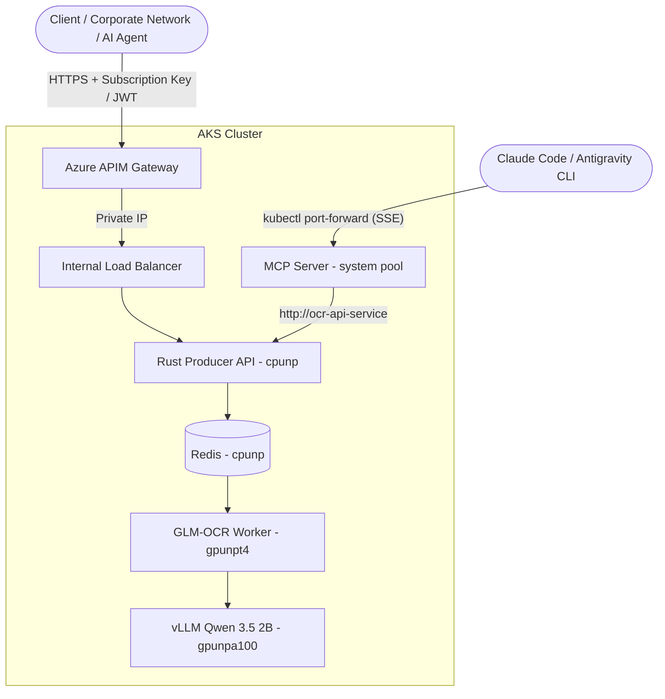

# 🛠️ Deployment Lifecycle & Operations Guide: Enterprise APIM Gateway & Claude Code MCP Server on AKS

This guide provides end-to-end instructions for closing out the OCR pipeline with two capstone pieces: an **Azure API Management (APIM)** perimeter that turns the internal-only `ocr-api-service` into a governed, rate-limited, JWT- or API-key-authenticated endpoint, and an **in-cluster Model Context Protocol (MCP) server** that wraps the same pipeline as a native tool for AI coding assistants (Claude Code, Antigravity CLI/IDE, Cursor).

---

## 🏗️ Architecture Topology

The deployment reuses the **Three-Tier Isolated Node Pool Architecture** from Weeks 3-5 and adds the MCP server as a lightweight, untainted workload on the default system pool — it only proxies HTTP calls to the Rust Producer, so it doesn't need a dedicated node pool:

1. **System Node Pool (`nodepool1` - Default)**:
   * **Role**: Runs cluster foundational services (CoreDNS, CSI storage drivers, KEDA operator, Prometheus/Grafana) **and** the new **MCP Server** (`ocr-mcp-server`).
   * **Isolation**: Untainted general-purpose node pool.
2. **Dedicated CPU Node Pool (`cpunp`)**:
   * **VM SKU**: `Standard_D8ds_v6` (8 vCPUs, 32 GiB RAM).
   * **Workload**: **Rust Producer API** (`ocr-api-rust` - Axum) and the **Redis** state store (`ocr-redis`).
   * **Role**: Accepts multipart file uploads, base64-encodes the payload, atomically `HSET`s task state into Redis, and `LPUSH`es the `task_id` onto the `ocr_tasks` queue. This is also the ingress point APIM sits in front of.
   * **Isolation**: Protected with node taint `sku=cpunp:NoSchedule`.
3. **Dedicated T4 GPU Node Pool (`gpunpt4`)**:
   * **VM SKU**: `Standard_NC16as_T4_v3` (16 vCPUs, 16GB VRAM).
   * **Workload**: **GLM-OCR Consumer Worker** (`ocr-worker-rt` - Python).
   * **Role**: Pops tasks from Redis using a **Dynamic Batching Collector**, writes binaries to a `/dev/shm` RAM-disk, runs **PP-DocLayoutV3** layout detection, and dispatches recognized regions to the vLLM engine.
   * **Isolation**: Protected with node taint `sku=gpunpt4:NoSchedule`.
4. **Dedicated GPU Node Pool (`gpunpa100`)**:
   * **VM SKU**: `Standard_NC24ads_A100_v4` (1x NVIDIA A100 80GB HBM2e).
   * **Workload**: **vLLM Inference Server** (`Qwen/Qwen3.5-2B`).
   * **Role**: High-throughput generative OCR/reasoning over the regions cropped by the layout detector.
   * **Isolation**: Protected with node taint `sku=gpunpa100:NoSchedule`.

**Request path with APIM in front:**



---

## 0. Prerequisites, Quotas & Environment Setup

> 💡 **Automated Workflow with Makefile:**
> A complete [Makefile](./Makefile) is provided in this directory. You can execute all tasks via `make` targets (e.g. `make infra-up`, `make build-all`, `make deploy`) or follow the CLI commands below.

```bash
# --- Core Identifiers ---
export LOCATION="francecentral"
export RESOURCE_GROUP="week3-dpl-rg"
export SUBSCRIPTION_ID="<YOUR_SUBSCRIPTION_ID>"
export AKS_NAME="akstnmweek3"
export ACR_NAME="acrtnmweek3"

# GPU Node Pool (vLLM Qwen 3.5 2B Engine)
export GPU_NODEPOOL_NAME="gpunpa100"
export GPU_VM_SIZE="Standard_NC24ads_A100_v4"

# T4 Node Pool (GLM-OCR Consumer Worker)
export T4_NODEPOOL_NAME="gpunpt4"
export T4_VM_SIZE="Standard_NC16as_T4_v3"

# CPU Node Pool (Rust Producer & Redis)
export CPU_NODEPOOL_NAME="cpunp"
export CPU_VM_SIZE="Standard_D8ds_v6"
```

> ℹ️ **Reusing the Course Cluster:**
> This walkthrough targets the same AKS cluster (`akstnmweek3` in `week3-dpl-rg`) provisioned in the [Week 3](../week3_vllm_deployment/README.md), [Week 4](../week4_rust_gateway_deployment/README.md), and [Week 5](../week5_async_architecture_deployment/README.md) walkthroughs. `az group create` / `az aks create` are idempotent, so running Section 1 below is safe even if the cluster already exists — this week doesn't add any new node pools, only new workloads (MCP server) and a fronting APIM gateway.

### 🧰 Local CLI Tooling Prerequisites

```bash
# Via Makefile check
make check-cli

# Manual install (macOS via Homebrew)
brew install azure-cli kubernetes-cli helm
```

### 🔑 Authenticate Azure CLI Session

```bash
# Via Makefile
make auth

# Or manually:
az login
az account set --subscription "$SUBSCRIPTION_ID"
az account show --output table
```

---

## 1. Infrastructure Setup: AKS Cluster & Node Pools

```bash
# ⚡ Automated via Makefile (idempotent — safe to re-run against the existing cluster):
make infra-up
make nodepool-gpu
make nodepool-t4
make nodepool-cpu

# -----------------------------------------------------------------------------
# Or Manual CLI Execution:
# -----------------------------------------------------------------------------

# 1. Create Resource Group
az group create --name $RESOURCE_GROUP --location $LOCATION

# 2. Create Azure Container Registry (ACR)
az acr create -g $RESOURCE_GROUP -n $ACR_NAME --sku Premium --location $LOCATION
az acr login --name $ACR_NAME

# 3. Create AKS Cluster with Blob CSI Driver and Managed Identity
az aks create \
  --resource-group $RESOURCE_GROUP \
  --location $LOCATION \
  --name $AKS_NAME \
  --attach-acr $ACR_NAME \
  --node-count 1 \
  --enable-managed-identity \
  --enable-blob-driver \
  --generate-ssh-keys

# 4. Download AKS credentials to local kubeconfig
az aks get-credentials \
  --resource-group $RESOURCE_GROUP \
  --name $AKS_NAME \
  --overwrite-existing
```

---

## 2. Storage Setup: Datacenter Model Weight Ingestion

Unchanged from Week 5 — ingest both model families directly from Hugging Face into the Azure Blob CSI PVC (`model-weights-pvc`):

```bash
# ⚡ Automated via Makefile:
make storage-pvc
make ingest-weights
make ingest-logs

# Or manual execution:
kubectl apply -f k8s/infra/pvc.yaml
kubectl delete job model-weight-ingest --ignore-not-found=true
kubectl apply -f k8s/infra/ingest-job.yaml
kubectl logs -f job/model-weight-ingest
```

---

## 3. Container Builds & ACR Push

Build the **vLLM Inference Server**, the **Rust Producer API**, the **GLM-OCR Consumer Worker**, and the new **MCP Server** container images directly inside ACR:

```bash
# ⚡ Automated via Makefile:
make build-all

# Or individually:
make build-vlm      # Builds vLLM (Qwen 3.5 2B) container
make build-api      # Builds Rust Producer API container
make build-worker   # Builds GLM-OCR Consumer Worker container
make build-mcp      # Builds the in-cluster MCP server container

# -----------------------------------------------------------------------------
# Or Manual CLI Execution:
# -----------------------------------------------------------------------------
az acr build --registry $ACR_NAME --image ocr-vlm-qwen:latest ./server --no-wait
az acr build --registry $ACR_NAME --image ocr-api-rust:latest ./client_rt_producer --no-wait
az acr build --registry $ACR_NAME --image ocr-worker-rt:latest ./client_rt_consumer --no-wait
az acr build --registry $ACR_NAME --image ocr-mcp-server:latest ./mcp_server --no-wait
```

> [!WARNING]
> **Matching ACR Registry Name in Manifests:**
> The deployment manifests (`k8s/apps/deployment-api.yml`, `k8s/apps/deployment-vlm.yml`, `k8s/apps/mcp-server-deployment.yml`) reference images at `acrtnmweek3.azurecr.io/...`. If you customized `$ACR_NAME`, update the registry hostname in all three files before applying. Otherwise, Kubernetes will fail with an `ImagePullBackOff (401 Unauthorized)` error.

---

## 4. Deploy Full Stack via Kustomize

```bash
# ⚡ Automated via Makefile:
make install-keda
make install-monitoring
make deploy

# -----------------------------------------------------------------------------
# Or Manual CLI Execution:
# -----------------------------------------------------------------------------
helm repo add kedacore https://kedacore.github.io/charts --force-update
helm upgrade --install keda kedacore/keda -n keda --create-namespace

helm repo add prometheus-community https://prometheus-community.github.io/helm-charts --force-update
helm repo update
kubectl create namespace monitoring --dry-run=client -o yaml | kubectl apply -f -
helm upgrade --install prometheus prometheus-community/kube-prometheus-stack \
  --namespace monitoring \
  --set prometheus.prometheusSpec.serviceMonitorSelectorNilUsesHelmValues=false \
  --set grafana.enabled=true

# Deploy All Workloads (Redis + Rust Producer + Worker + vLLM + MCP Server + Services + KEDA Scalers)
kubectl apply -k k8s/
```

### ⚡ Independent KEDA Autoscaling Specifications

Unchanged from Week 5 — defined in [`k8s/apps/keda-scaler.yml`](./k8s/apps/keda-scaler.yml). The MCP server itself is a fixed single replica (`ocr-mcp-deployment`, no `ScaledObject`) since it's a thin, stateless proxy with negligible load:

| Workload | Target Deployment | Scale Range | Primary Scaling Indicators | Cooldown |
| :--- | :--- | :--- | :--- | :--- |
| **Rust Producer API** | `ocr-api-deployment` | `1` ↔ `5` Pods | **CPU Utilization > 70%** (multipart upload bursts) | Default |
| **GLM-OCR Consumer Worker** | `ocr-worker-rt-deployment` | `0` ↔ `10` Pods | **1. Business-Hours Cron Warm Start** (Mon-Fri 08:00–19:00: min 1 replica)<br>**2. Redis Queue Length >= 1** (`ocr_tasks` list) | `300s` |
| **vLLM Inference Engine** | `ocr-vlm-deployment` | `0` ↔ `4` Pods | **1. Business-Hours Cron Warm Start** (Mon-Fri 08:00–19:00: min 1 replica)<br>**2. Prometheus vLLM Queue Depth** (`vllm:num_requests_waiting >= 1`) | `300s` |

---

## 5. Enterprise Exposure: Azure API Management (APIM)

Exposing `ocr-api-service` via a public LoadBalancer IP is not recommended for production — it invites DDoS, brute-force requests, and runaway KEDA scale-out from unauthenticated bursts. Instead, this deployment fronts the pipeline with **Azure API Management (APIM)** in **Internal VNet mode**, giving it a governed, rate-limited, authenticated entry point.

#### 🛡️ Why APIM + VNet Isolation?

1. **Private Load Balancing**: `k8s/networking/service.yml` should carry the annotation `service.beta.kubernetes.io/azure-load-balancer-internal: "true"` so `ocr-api-service` only ever gets a private IP inside the VNet, never a public one.
2. **Private API Gateway**: APIM is deployed in a dedicated subnet inside the AKS virtual network in **Internal VNet mode** — no public IP, reachable only via VNet Peering, Azure VPN Gateway, or ExpressRoute.
3. **Defense-in-Depth (optional)**: Chain **Azure Application Gateway + WAF** in front of APIM for SSL termination and OWASP Top 10 protection, while APIM handles rate-limiting, auth, and backend routing.

#### Provisioning Steps

```bash
# 1. Discover the AKS-managed VNet/subnet (needed for APIM's --vnet-id / --subnet-name)
NODE_RG=$(az aks show -g $RESOURCE_GROUP -n $AKS_NAME --query nodeResourceGroup -o tsv)
VNET_NAME=$(az network vnet list -g $NODE_RG --query "[0].name" -o tsv)
az network vnet subnet list -g $NODE_RG --vnet-name $VNET_NAME --query "[].name" -o table

# 2. Create the APIM instance in Internal VNet mode (takes 30-45 minutes)
az apim create \
  --name "apim-ocr-service" \
  --resource-group $RESOURCE_GROUP \
  --location $LOCATION \
  --publisher-email "admin@yourcompany.com" \
  --publisher-name "OCR Team" \
  --sku-name Developer \
  --virtual-network Internal \
  --vnet-id "/subscriptions/$SUBSCRIPTION_ID/resourceGroups/$RESOURCE_GROUP/providers/Microsoft.Network/virtualNetworks/<vnet-name>" \
  --subnet-name "<subnet-name>"

# 3. Register the internal AKS service as an APIM backend
INTERNAL_IP=$(kubectl get svc ocr-api-service -o jsonpath='{.status.loadBalancer.ingress[0].ip}')
az apim backend create \
  --resource-group $RESOURCE_GROUP \
  --service-name "apim-ocr-service" \
  --backend-id "ocr-api-backend" \
  --url "http://$INTERNAL_IP" \
  --protocol http

# 4. Define the API & its two operations
az apim api create \
  --resource-group $RESOURCE_GROUP \
  --service-name "apim-ocr-service" \
  --api-id "ocr-api" \
  --path "ocr" \
  --display-name "High-Performance OCR API"

az apim api operation create \
  --resource-group $RESOURCE_GROUP --service-name "apim-ocr-service" --api-id "ocr-api" \
  --url-template "/process" --method "POST" --display-name "Submit OCR Task"

az apim api operation create \
  --resource-group $RESOURCE_GROUP --service-name "apim-ocr-service" --api-id "ocr-api" \
  --url-template "/status/{task_id}" --method "GET" --display-name "Get OCR Task Status"

# 5. Apply the JWT + rate-limit governance policy
make apim-policy
# Or manually: az apim api operation policy set --resource-group $RESOURCE_GROUP \
#   --service-name "apim-ocr-service" --api-id "ocr-api" --operation-id "post-process" \
#   --policy-value "../k8s/aks/networking/apim-policy.xml"

# 6. Group into a Product and issue a Subscription (API Key) for partner/CLI access
az apim product create --resource-group $RESOURCE_GROUP --service-name "apim-ocr-service" \
  --product-id "ocr-partner-tier" --display-name "OCR Partner Tier" --subscription-required true --state published
az apim product api add --resource-group $RESOURCE_GROUP --service-name "apim-ocr-service" \
  --product-id "ocr-partner-tier" --api-id "ocr-api"
az apim subscription create --resource-group $RESOURCE_GROUP --service-name "apim-ocr-service" \
  --subscription-id "partner-abc-key" --display-name "Partner ABC Subscription" \
  --product-id "ocr-partner-tier" --state active
az apim subscription show --resource-group $RESOURCE_GROUP --service-name "apim-ocr-service" \
  --subscription-id "partner-abc-key" --query primaryKey -o tsv
```

**Governance model**: Zero-Trust JWT (`Authorization: Bearer <token>`, validated via Microsoft Entra ID) for internal identities, and API Key (`Ocp-Apim-Subscription-Key: <key>`) for external partners/CLI usage. Throttling at the APIM layer indirectly protects the A100/T4 pools by preventing abusive bursts from triggering unnecessary KEDA scale-out.

**Example authenticated request through APIM:**

```bash
TASK_RESP=$(curl -s -X POST "https://apim-ocr-service.azure-api.net/ocr/process" \
     -H "Ocp-Apim-Subscription-Key: YOUR_API_KEY" \
     -F "file=@invoice.pdf")
TASK_ID=$(echo $TASK_RESP | jq -r '.task_id')

curl -s "https://apim-ocr-service.azure-api.net/ocr/status/$TASK_ID" \
     -H "Ocp-Apim-Subscription-Key: YOUR_API_KEY"
```

---

## 6. Bridging AI Coding Assistants via MCP

The [`mcp_server/`](./mcp_server) directory ships a **FastMCP**-based server exposing a single tool, `parse_document(file_path, include_layout)`, that submits a file to the Rust Producer and polls until the OCR result is ready. It's deployed in-cluster as `ocr-mcp-deployment` / `ocr-mcp-service` (SSE transport, port `8000`), but can also run locally over Stdio.

### Option A — In-Cluster (SSE transport)

```bash
# 1. Tunnel the in-cluster MCP service to your machine
make port-forward-mcp
# Or: kubectl port-forward svc/ocr-mcp-service 8000:8000

# 2. Register it with your AI assistant, in a second terminal
```

**Claude Code:**
```bash
make mcp-register-claude
# Or: claude mcp add tnm-ocr --transport sse http://localhost:8000/sse
```

**Antigravity CLI (`agy`) / Antigravity IDE** — add to `~/.gemini/config/mcp_config.json` or `.agents/mcp_config.json`:
```json
{
  "mcpServers": {
    "tnm-ocr": { "serverUrl": "http://localhost:8000/sse" }
  }
}
```
```bash
agy "Use tnm-ocr to parse sample_image.png and summarize key findings"
```

**Cursor** — add to `.cursor/mcp.json`:
```json
{
  "mcpServers": {
    "tnm-ocr": { "serverUrl": "http://localhost:8000/sse" }
  }
}
```

### Option B — Local (Stdio transport)

Skip the cluster entirely and run the MCP server as a local subprocess pointed at a port-forwarded (or APIM-fronted) Producer API:

```bash
make mcp-local
claude mcp add tnm-ocr -- python3 $(pwd)/mcp_server/server.py
```

See [`mcp_server/README.md`](./mcp_server/README.md) for the full connection matrix (including going through APIM with `APIM_SUBSCRIPTION_KEY`).

---

## 7. Client Invocation & Access Recipes

### 🔒 Ingress Topology & Zero-Trust Access Model
* **Private ClusterIP/Internal-LB Topology**: `ocr-api-service` is annotated `service.beta.kubernetes.io/azure-load-balancer-internal: "true"`, so it never receives a public IP. `ocr-vlm-service`, `ocr-redis-service`, and `ocr-mcp-service` are plain `ClusterIP` — reachable only from inside the cluster network.
* **Zero Public Attack Surface**: The only path in from the outside world is through APIM (Section 5); local development is tunneled via authenticated `kubectl port-forward` sessions.

### Async API Specification (unchanged from Week 5)

```bash
# Submit
curl -X POST http://localhost:5000/process -F "file=@sample_image.png"
# -> {"task_id": "8a32b6e4-6a01-4475-9b22-83cfbc63a4dc", "status": "queued"}

# Poll
curl http://localhost:5000/status/8a32b6e4-6a01-4475-9b22-83cfbc63a4dc
```

```bash
# ⚡ Or the automated end-to-end test via Makefile:
make test-submit
```

### Inspecting Each Stage in Real Time

```bash
make logs-api      # Rust Producer API (cpunp)
make logs-worker    # GLM-OCR Consumer Worker (gpunpt4)
make logs-vlm       # vLLM Server (gpunpa100)
make logs-mcp       # In-cluster MCP server (system pool)
```

---

## 8. Cost Optimization: Scaling Both GPU Node Pools to Zero

Unchanged from Week 5 — when development is paused, scale the T4 and A100 node pools to zero. The `cpunp` pool (Redis + Rust Producer) and the MCP server on the system pool are left running since they're cheap, always-on components:

```bash
# ⚡ Via Makefile:
make scale-to-zero

# Or manually:
az aks nodepool update -g $RESOURCE_GROUP --cluster-name $AKS_NAME -n $GPU_NODEPOOL_NAME --update-cluster-autoscaler --min-count 0 --max-count 4
az aks nodepool update -g $RESOURCE_GROUP --cluster-name $AKS_NAME -n $T4_NODEPOOL_NAME --update-cluster-autoscaler --min-count 0 --max-count 10
```

---

## 🔍 Monitoring & Resources
*   [Model Context Protocol Specification](https://modelcontextprotocol.io/)
*   [Claude Code MCP Documentation](https://docs.claude.com/en/docs/claude-code/mcp)
*   [Azure API Management Internal VNet Mode](https://learn.microsoft.com/en-us/azure/api-management/api-management-using-with-internal-vnet)
*   [HuggingFace: Qwen3.5-2B](https://huggingface.co/Qwen/Qwen3.5-2B)
*   [HuggingFace: PaddleOCR-VL 1.5 / PP-DocLayoutV3](https://huggingface.co/PaddlePaddle/PaddleOCR-VL-1.5)
*   [vLLM Inference Engine](https://docs.vllm.ai/)
*   [KEDA Redis Lists Scaler](https://keda.sh/docs/scalers/redis-lists/)
*   [Azure AKS Managed GPU Drivers Guide](https://learn.microsoft.com/en-us/azure/aks/gpu-cluster)
